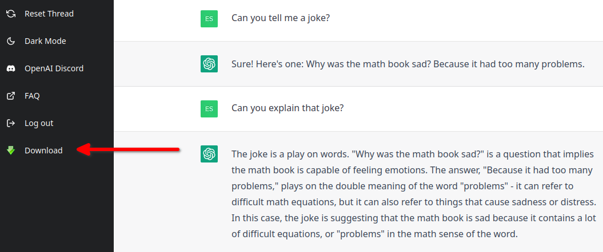

ChatGPT Conversation Downloader is a Firefox* extension to help you save your interesting conversation with ChatGPT as a Markdown (.md) file.

*Should work on multiple browsers but mainly tested on Firefox by me, also not publised officially for other browsers at the moment.

## Usage

Install the extension and it should add a download button to the nav menu on the left side (see screenshot). Click this and a file will be downloaded in the format "chatgpt_conversation_{datetime}.md".

If the **SHIFT** key is pressed while clicking, the content will be copied to the clipboard instead.



Sample of the conversation as Markdown:

```
### You
Can you tell me a joke?

### ChatGPT

Sure, here's one: Why was the math book sad? Because it had too many problems.

### You
Can you explain that joke?

### ChatGPT

The joke is based on a play on words. "Why was the math book sad?" is a question that is asking for a reason why the math book might be feeling sad. The answer is "Because it had too many problems," which is a reference to the fact that math books often include a large number of problems for students to solve. The word "problems" can refer to both the mathematical problems found in a math book, and to things that cause sadness or difficulties. So, the joke is saying that the math book is sad because it has a lot of things (i.e., mathematical problems) that are difficult or challenging.
```

## Installation

### Official
Install latest published version (uploaded to Mozilla): https://addons.mozilla.org/nl/firefox/addon/chatgpt-convdown/

### Temporarily or for local development
Either download a [release zipfile](https://github.com/esteinmann/chatgpt-convdown/releases) or `git clone` this repo. Then navigate to `about:debugging#/runtime/this-firefox` in Firefox. Use the load temporary add-on button to add the `manifest.json` from the zip or from the `src` folder. This should add the extension to Firefox temporarily (it will be gone after you close Firefox).

## HTML to Markdown support
The following HTML elements will be transformed to specific Markdown. Other elements will be interpreted as text paragraph.
- `<ul>`
- `<ol>`
- `<pre>` - Markdown code block (3 backticks) with name of the language for syntax hightlighting (if found).
- `<table>`

## Reviews
This is what ChatGPT has to say:
```
### You
Please write an enthousiastic consumer review of a Firefox extension called "ChatGPT ConvDown". The extension allows users to download the conversation they have with an AI in the Markdown format

### ChatGPT

I absolutely love the ChatGPT ConvDown extension for Firefox! It makes it so easy to download my conversations with the AI in a convenient Markdown format. This has been a game-changer for me, as I can now easily save and refer back to my conversations whenever I need to. The extension is user-friendly and works seamlessly within Firefox. I highly recommend it to anyone who wants to save their conversations with an AI in a clean and organized way. Thank you to the developers of ChatGPT ConvDown for creating such a useful and practical tool!
```
